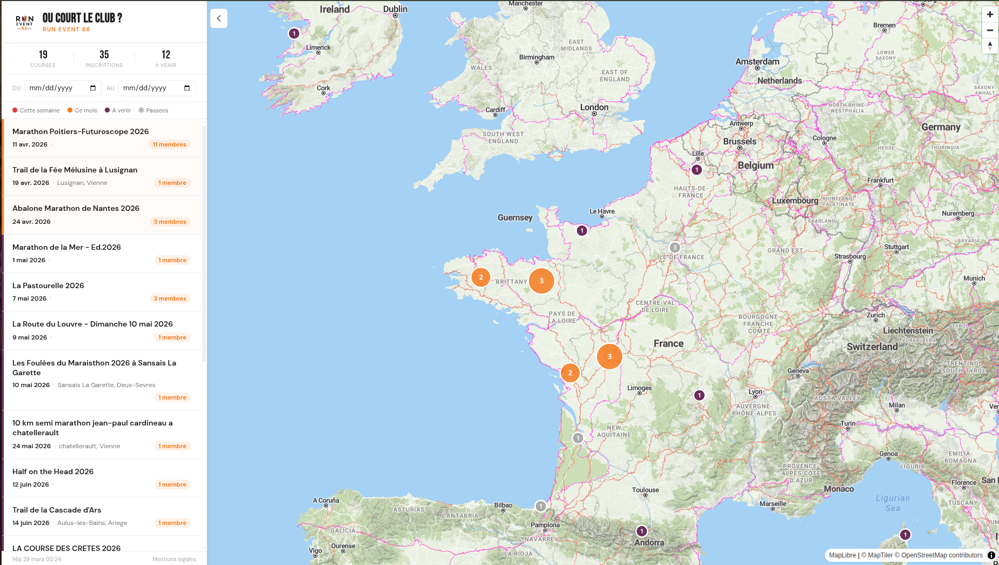

# Ou court le club ? 🏃‍♂️🗺️

Carte interactive des courses ou les membres du club **[Run Event 86](https://www.facebook.com/RunEvent86/)** (Vienne, 86) sont inscrits.

**[Voir la carte](https://juulieen.github.io/ou-court-le-club/)**

[](https://juulieen.github.io/ou-court-le-club/)

## Comment ca marche ?

Un pipeline de scrapers parcourt chaque jour les listes d'inscription de **13 plateformes** de courses a pied en France. Il detecte les membres du club via deux methodes :

1. **Par club** — regex sur le champ "club" des inscriptions (ex: "Run Event 86", "RunEvent", etc.)
2. **Par nom** — liste de membres connus pour ceux qui n'ont pas rempli le champ club

Les resultats sont affiches sur une carte MapLibre GL avec les tuiles MapTiler.

## Plateformes scannees

| Plateforme | Methode |
|---|---|
| Klikego | AJAX POST + recherche par club |
| Njuko | API REST + cache de slugs |
| OnSinscrit | HTML scraping |
| Protiming | Filtre club en URL |
| Chronometrage.com | Next.js JSON |
| Chrono-Start | HTML + cloudscraper (Cloudflare) |
| 3wsport | HTML scraping par departement |
| Espace-Competition | HTML pagine |
| Sportips | API JSON / HTML ancien format |
| TimePulse | HTML scraping |
| Endurance Chrono | HTML tri par club |
| Listino | HTML pagine |
| RunChrono | Decouverte locale (dept 86) -> OnSinscrit |

## Stack technique

- **Frontend** : MapLibre GL JS + MapTiler (outdoor-v2) + HTML/CSS/JS statique
- **Backend** : Python (requests, BeautifulSoup, cloudscraper)
- **Geocoding** : API BAN (primaire) + Nominatim (fallback)
- **Hebergement** : GitHub Pages
- **CI/CD** : GitHub Actions (scraping quotidien a 6h UTC)

## Installation locale

```bash
# Cloner le repo
git clone https://github.com/juulieen/ou-court-le-club.git
cd ou-court-le-club

# Creer le fichier de config (voir config.example.yml)
cp config.example.yml config.yml
# Editer config.yml avec les patterns du club et les noms des membres

# Installer les dependances
python -m venv .venv
source .venv/bin/activate
pip install -r requirements.txt

# Lancer le scraper
python -m scrapers.main

# Voir la carte
# Ouvrir docs/index.html dans un navigateur
```

## Configuration

Copier `config.example.yml` en `config.yml` et remplir :

- `club.patterns` — expressions regulieres pour matcher le nom du club
- `club.known_members` — liste des membres connus (format "NOM Prenom")
- `races` — courses manuelles (optionnel, pour les plateformes non supportees)

## Vie privee

Ce projet respecte le RGPD :

- **Aucun nom** n'est publie sur le site — seul le nombre de membres par course est affiche
- Le fichier `config.yml` (contenant les noms) est **gitignore** et stocke en secret GitHub
- Les donnees sont collectees a partir de listes d'inscription **publiques**

## Licence

MIT

---

*Projet personnel de [Julien OLLIVIER](https://github.com/juulieen), membre du club Run Event 86. Ce projet n'est pas une initiative officielle du club.*
